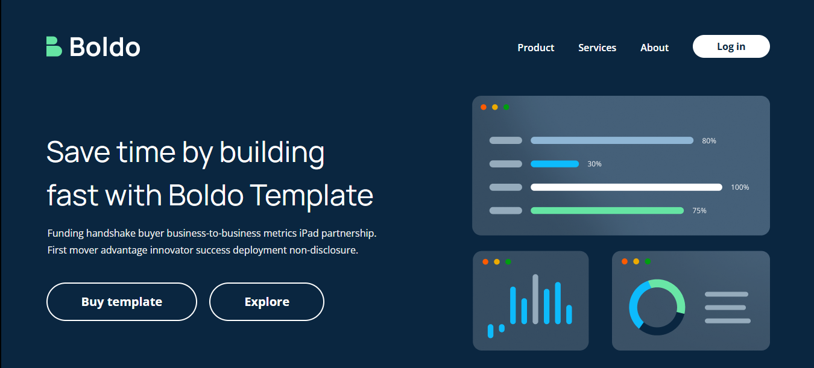

# 🌐 BOLDO – Pixel Perfect Landing Page

**BOLDO** is a fully responsive, **pixel-perfect business website** built from a Figma design during my internship at **Revnix**.  
It demonstrates professional front-end development practices, clean responsive layouts, and modern web design structure.

---

## 🚀 Live Demo  
👉 [Live Website Link](#)  

---

## 🖼️ Preview  


---

## 💡 Overview  

This project is a **Figma to Code conversion**, ensuring pixel-perfect alignment with the original design.  
It’s developed using **HTML**, **CSS**, and **Vanilla JavaScript**, with reusable components and responsive UI principles.

---

## ✨ Features  

- 🎨 Pixel-perfect match with Figma design  
- 📱 Fully responsive for all screen sizes  
- 🧭 Smooth navigation bar with hamburger menu  
- 💼 Professional multi-section business layout  
- 📰 Services, About, Blog, and Testimonials sections  
- 💬 Accordion-style FAQ for better interactivity  
- 🧱 BEM naming convention for scalable CSS  

---

## 🗂️ Project Structure  

```
BOLDO-Website/
│
├── index.html              # Main HTML file
├── css/
│   └── style.css           # Website styling
│
├── js/
│   └── script.js           # Navigation and interactivity logic
│
├── images/
│   ├── homepage.png        # Homepage screenshot
│   └── other-assets.png
│
└── README.md               # Project documentation
```

---

## 🛠️ Built With  

| Technology | Purpose |
|-------------|----------|
| **HTML5** | Structure & layout |
| **CSS3 (Flexbox & Grid)** | Styling & responsiveness |
| **Font Awesome** | Icons & UI assets |
| **Google Fonts (Manrope & Open Sans)** | Typography |
| **JavaScript (ES6)** | Interactivity |

---

## ⚙️ How to Run Locally  

1. Clone this repository:  
   ```bash
   git clone https://github.com/UmarKhan-codeer/BOLDO-Website.git
   ```

2. Navigate to the project folder:  
   ```bash
   cd BOLDO-Website
   ```

3. Open the website in your browser:  
   ```bash
   start index.html
   ```

---

## 👨‍💻 Author  

**Umar Khan**  
💼 Front-End Developer (Intern @ Revnix)  
📧 [your-email@example.com](mailto:your-email@example.com)  
🌐 [Portfolio Link](https://portfolio-umer-pro.vercel.app/)

---

## 📄 License  
This project is open-source under the **MIT License**.

---

## ⭐ Acknowledgments  

- Design inspired by **Figma Boldo Template**  
- Icons: [Font Awesome](https://fontawesome.com/)  
- Fonts: [Google Fonts](https://fonts.google.com/)  
